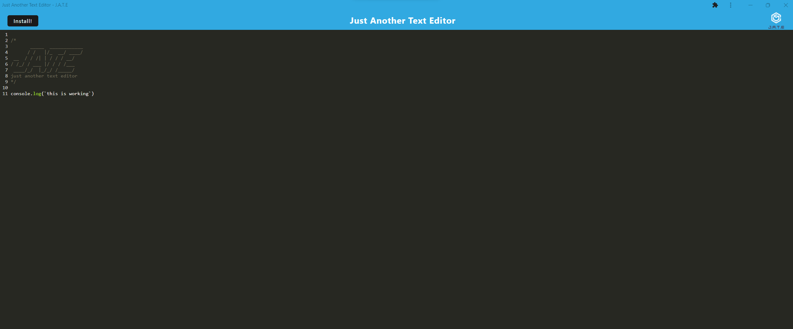

# 19-Text-Editor

Progressive Web Application: Text Editor

## Description

Thanks to advancements of modern technology, we are ever reliant on having WiFi access. In the times that the WiFi signal is weak or unavailable, it's important that our most vital applications have some form of offline capabilities. This project aims at creating a progressive web application(PWA) in the form of a note-taker/ text-editor to have portable notebook wherever you go. This note-taker / text-editor has offline capabilities that will save your notes or code snippets in a local database and will display those notes created upon opening or refresh until the user deletes the note/text.

A link to the deployed application can be found [here](https://warm-spire-99580-61e0bdcb56b4.herokuapp.com/)

Sreenshot of installed application:

## Table of Contents

- [Installation](#installation)
- [Usage](#usage)
- [License](#license)
- [Contributing](#contributing)
- [Test](#test)
- [Questions](#questions)
- [Credit](#credit)

## Installation

### Programs needed for this project:

- GitBash (windows) or Terminal (Mac)
- Node.js
- MongoDB
- Insomnia

Locate a suitable place where you would like to download this repository. Once found, copy the repositories SSH or HTTPS to clone through the terminal or download the zipfile from GitHub. After it is downloaded, please ensure that node.js is installed. Once it is installed and at least version 18 or higher, go to your terminal, navigate to the directory that contains this repository. Once there please type in the CLI 'npm run install' followed by 'npm run build'. This will cause the node_modules to be downloaded and a dist folder to be generated inside of the client folder. When the dist folder is created, please use the CLI command of 'npm run start:dev'. This will make the local build of this application live on localhost:3000. You can head there to interact with the app as well as download the application for offline functionality.

## Usage

This repository is allowed for use in a learning environment to evaluate and analyze.

## License

    Please see the MIT license found in the repository. To learn more, please click the license badge at the top of the README.MD

## Contributing

- Express for their [modules](https://expressjs.com/)
- nodemon for their [modules](https://www.npmjs.com/package/nodemon)
- UCI BootCamp for the acceptance criteria and starter code.

## Test

There are no tests made for this project

## Questions

If you have further questions about this project, please send an email or checkout us out on GitHub.

Email: kyleochata@gmail.com

GitHub Link: https://github.com/kyleochata

## Credit

This project was created by Kyle Etrata
